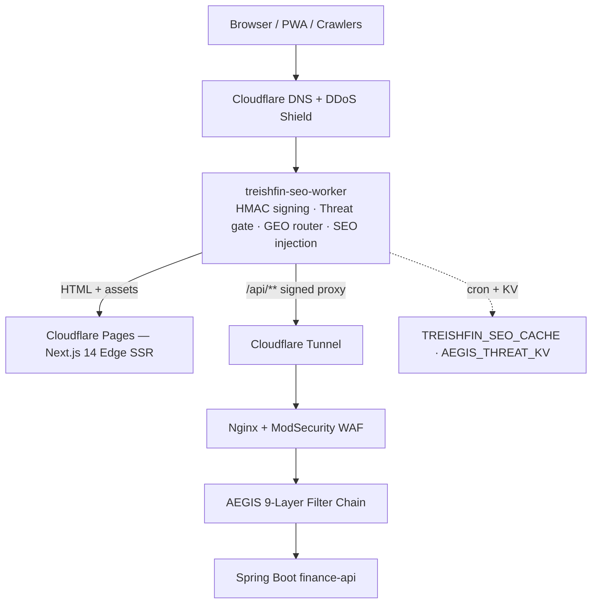

# Treishvaam Finance Frontend

**Next.js 14 App Router · Cloudflare Pages Edge SSR · Cloudflare Edge Worker**

India's premier financial news and market intelligence platform. Engineered for zero-trust security, edge-side rendering, enterprise SEO, Generative Engine Optimization (GEO), and first-party analytics ownership.

| | |
| :--- | :--- |
| **Production domain** | `treishvaamfinance.com` (sole entry point: `treishfin-seo-worker`) |
| **Hosting** | Cloudflare Pages (Next.js Edge SSR) + Cloudflare Workers |
| **Backend** | Spring Boot `finance-api` behind Cloudflare Tunnel, Nginx/ModSecurity, and the AEGIS 9-Layer Zero-Trust filter chain |
| **License** | Proprietary — see [`LICENSE.md`](LICENSE.md). Redistribution, competing use, and AI/ML training are strictly prohibited. |

---

## Documentation

The authoritative engineering reference for this repository is the FE documentation suite:

| Document | Subject |
| :--- | :--- |
| `docs/FE-00-INDEX.md` | Master index & page routing matrix |
| `docs/FE-01-ARCHITECTURE.md` | App Router architecture, RSC boundaries, Edge SSR hosting, PWA, image pipeline |
| `docs/FE-02-EDGE-WORKERS.md` | Edge Worker: HMAC-SHA-512 signing, MTD, threat KV, GEO routing, cron |
| `docs/FE-03-STATE-AND-DATA.md` | State management, API consumption layer, cross-system contract mapping |
| `docs/FE-04-SECURITY-INTEGRATION.md` | Keycloak OIDC lifecycle, CSP nonce, AEGIS client adherence |
| `docs/FE-05-COMPONENTS.md` | Component architecture, design tokens, accessibility |
| `docs/FE-06-SEO-METADATA.md` | Metadata, JSON-LD, GEO payloads, sitemaps |
| `docs/FE-07-DEPLOYMENT.md` | Build & deployment, environment matrix, rollback procedures |

Cross-system contract: `CROSS-SYSTEM-CONTEXT.md` (API endpoints, HMAC headers, WebSocket channels, auth expectations). Backend reference: `BE-00` … `BE-06` suite.

---

## Tech Stack

| Layer | Technology | Version |
| :--- | :--- | :--- |
| Framework | Next.js (App Router, Edge Runtime) | 14.2.x |
| UI Runtime | React / React DOM | 18.3.x |
| Language | TypeScript (`app/`) + JavaScript (`src/`) | TS 6.0.x (dev) |
| Styling | Tailwind CSS + Typography plugin | 3.4.x |
| Rich Text Editor | Tiptap | 3.23.x |
| Authentication | keycloak-js (OIDC, PKCE S256) | ^25.0.0 |
| HTTP Client | Axios | 1.6.7 |
| RUM & Analytics | Grafana Faro + first-party beacon | Faro 2.0.x |
| PWA | Serwist | 9.0.2 |
| Charting | lightweight-charts / recharts | 4.1.3 / 3.8.x |
| Sanitization | DOMPurify | 3.0.x |
| Video | hls.js | 1.7.x |
| Edge Compute | Cloudflare Workers (V8 isolate) | — |
| Deployment | Cloudflare Pages — Edge SSR | — |

---

## Architecture



**Key properties**

- **Edge-first:** the Worker is the sole HTTP entry point. The browser never talks to the backend directly; every `/api/**` call is intercepted, HMAC-SHA-512-signed, and forwarded. Unsigned direct-to-origin traffic is discarded by the backend's `AegisEdgeValidationFilter`.
- **Edge SSR, not static export:** `export const runtime = 'edge'` in `app/layout.tsx` with dynamic rendering driven by per-request CSP nonces. Never re-add `output: 'export'`.
- **Dual-layer migration model:** `app/` (TypeScript) is the URL surface; `src/` (legacy CRA JavaScript) provides the component tree, imported by thin `app/*/page.tsx` wrappers. `pageExtensions: ['tsx', 'ts']` guarantees `src/pages/*.js` can never become routes.
- **Tenant isolation:** server-side and Edge fetches to the backend must include `X-Tenant-ID: finance`.
- **Generative Engine Optimization (GEO):** AI crawlers (GPTBot, ClaudeBot, DeepSeek, PerplexityBot, and a verified matrix of 50+ crawler user-agents) are intercepted at the Edge and served semantic payloads (`/llms.txt`, `/ai-feed.md`, `/ontology.json`) directly from KV — bypassing React entirely.
- **Three-tier edge cache-shielding:** CDN cache → Cloudflare KV → backend fallback. Guarantees SEO uptime during API outages.

---

## Security & Configuration (Zero Trust)

All production URLs, API origins, and tracking IDs are **decoupled from source code** and injected via Cloudflare environment variables. **Never hardcode any of these.**

### Environment Variables

Copy `.env.example` to `.env` for local development:

| Variable | Description | Required |
| :--- | :--- | :--- |
| `NEXT_PUBLIC_API_URL` | Spring Boot backend API base URL | **Yes** |
| `NEXT_PUBLIC_AUTH_URL` | Keycloak auth server base URL (realm `treishvaam`, client `finance-app`). Read by `src/context/AuthContext.js` — initialization **hard-halts** when missing | **Yes** |
| `NEXT_PUBLIC_GA_MEASUREMENT_ID` | Google Analytics 4 Measurement ID (`G-XXX`) | Yes |
| `NEXT_PUBLIC_GOOGLE_ADS_ID` | Google Ads Conversion ID (`AW-XXX`) | Yes |
| `NEXT_PUBLIC_ADSENSE_CLIENT_ID` | Google AdSense Publisher ID (`ca-pub-XXX`) | Yes |
| `NEXT_PUBLIC_ENFORCE_STRICT_PRIVACY` | `true` / `false` — conditionally injects `anonymize_ip: true` into GA4 without a rebuild | Yes |
| `NEXT_PUBLIC_CHAIRMAN_PORTRAIT_URL` | Dynamic URL for team portrait (asset changes without a git commit or rebuild) | Yes |
| `NEXT_PUBLIC_FARO_URL` | Grafana Faro RUM collector endpoint (inlined at build time; falls back to backend domain) | Yes |

**Only the `NEXT_PUBLIC_*` prefix is valid.** `REACT_APP_*` is dead CRA convention and does nothing in this application.

> ⚠ **Template gap:** `.env.example` currently omits `NEXT_PUBLIC_AUTH_URL` and `NEXT_PUBLIC_FARO_URL`. Add them to your local `.env` manually, and add the lines to `.env.example` in your next commit — without `NEXT_PUBLIC_AUTH_URL`, the auth layer fatally halts on boot.

### Content Security Policy

`middleware.ts` generates a per-request nonce (`btoa(crypto.randomUUID())` — Edge-safe) and injects it into the CSP. `'unsafe-inline'` and `'unsafe-eval'` are prohibited in `script-src`/`style-src`. `silent-check-sso.html` is the sole, deliberate inline-script exemption (required by the Keycloak silent-SSO iframe).

### Worker Secrets

Set only via `npx wrangler secret put` — never in `wrangler.toml`, never in git:

| Secret | Purpose |
| :--- | :--- |
| `AEGIS_EDGE_SECRET` | HMAC-SHA-512 signing seed — must byte-match the backend secret. Rotation is a coordinated two-sided operation (see `docs/FE-07-DEPLOYMENT.md`) |
| `BACKEND_API_URL` | Cloudflare Tunnel URL to the Spring Boot backend |
| `BACKEND_URL` | Fallback alias |

---

## Project Structure

```
treishvaam-finance-frontend/
├── app/                          # Next.js App Router — URL routes (.tsx/.ts ONLY)
│   ├── layout.tsx                # Root shell: runtime='edge', CSP nonce, GA4, GEO tags
│   ├── page.tsx                  # Landing page /
│   ├── providers.tsx             # Client contexts (Auth, Theme, Watchlist)
│   ├── not-found.tsx             # Custom 404
│   ├── home/page.tsx             # Blog feed (301 → / via middleware)
│   ├── about/ contact/ vision/ privacy/ terms/   # Static pages (metadata exports)
│   ├── login/                    # Login page + minimal-chrome layout
│   ├── market/[ticker]/page.tsx  # Market detail
│   ├── category/[categorySlug]/[postSlug]/[id]/page.tsx  # Article (generateMetadata + JSON-LD)
│   ├── dashboard/                # Auth-gated admin routes
│   │   ├── layout.tsx  page.tsx
│   │   ├── blog/new/  blog/edit/[userFriendlySlug]/[id]/
│   │   └── manage-posts/  audience/  api-status/  profile/
│   ├── llms.txt/route.ts         # GEO proxy → /api/public/geo/llms.txt
│   ├── ai-feed.md/route.ts       # GEO proxy → /api/public/geo/ai-feed.md
│   ├── ontology.json/route.ts    # GEO proxy → /api/public/geo/ontology.json
│   └── opensearch.xml/route.ts   # OpenSearch description XML
│
├── src/                          # Legacy CRA source — components, NOT routes
│   ├── pages/*.js                # Page components (imported by app/ wrappers; "use client")
│   ├── components/
│   │   ├── AegisTelemetry.tsx    # L5-BIE biometric telemetry (client only)
│   │   ├── WebVitalsTracker.tsx  # Core Web Vitals
│   │   ├── ThirdPartyScripts.js  # Interaction-deferred loading (0 ms TBT)
│   │   ├── annotations/          # Reader suite (highlighter, pen, calculator, snipping)
│   │   ├── BlogEditor/           # Tiptap v3 CMS panels + modals
│   │   ├── BlogPage/  market/  market-detail/  news/  manage-posts/
│   ├── context/                  # Auth, Theme, Watchlist, Annotation, FloatingDock
│   ├── hooks/  layouts/  lib/
│   ├── apiConfig.js              # Axios instance + API function catalogue
│   ├── faroConfig.js             # Faro RUM + first-party analytics beacon
│   ├── sw.ts                     # Serwist service worker source
│   └── utils/                    # cloudflareImageLoader, schemaGenerator, react-router-shim, …
│
├── worker/
│   ├── worker.js                 # Edge Worker (AEGIS, GEO, KV cache, HMAC signing)
│   └── wrangler.toml             # Worker config: KV bindings + hourly cron
│
├── docs/                         # FE-00 … FE-07 enterprise suite (source of truth)
├── middleware.ts                 # CSP nonce + /home → / 301 (Edge-safe)
├── next.config.mjs               # Serwist, custom image loader, headers, pageExtensions
├── tailwind.config.js  tsconfig.json  jsconfig.json  postcss.config.mjs
├── wrangler.toml                 # Cloudflare Pages project IaC (next-on-pages output + nodejs_compat) — REQUIRED
├── public/
│   ├── logo.webp                 # ⚠ logo.png does NOT exist — always use logo.webp
│   ├── manifest.json  robots.txt
│   ├── sitemap.xml  sitemap-static.xml
│   ├── silent-check-sso.html     # Keycloak silent SSO iframe
│   └── .well-known/security.txt
└── LICENSE.md  README.md
```

---

## Local Development

### Prerequisites
- Node.js 20+
- npm
- Wrangler via `npx` (no global install required)

### Setup
```bash
npm ci                     # NEVER npm install — matches Cloudflare Pages build behavior
cp .env.example .env       # Windows: copy .env.example .env
# Populate .env — including NEXT_PUBLIC_AUTH_URL (see template-gap warning above)
npm run dev                # http://localhost:3000
```

The Serwist service worker is automatically disabled in development.

### Build
```bash
npm run build
```

---

## Deployment

### Frontend — Cloudflare Pages (automatic)
Push to `main` → Cloudflare Pages runs `npm ci` + `next build` (Edge SSR) → deployed to the global CDN. Environment variables are configured in **Cloudflare Dashboard → Workers & Pages → treishvaam-finance-frontend → Settings → Environment Variables**.

`package-lock.json` must always be committed in lockstep with `package.json`. Cloudflare Pages uses `npm ci` — a missing or out-of-sync lockfile crashes the build.

### Edge Worker — manual, conditional, deploy FIRST
Deploy the Worker **only** when `worker/worker.js` or `worker/wrangler.toml` changed — and deploy it **before** pushing frontend changes that depend on it:

```bash
cd worker
npx wrangler deploy
```

### Full sequence
```bash
# 1. If worker/ changed — deploy Worker first:
cd worker && npx wrangler deploy && cd ..

# 2. Then push the frontend:
git checkout main
git add .
git commit -m "feat: description"
git push origin main
```

### Backend boundary
Backend deployment is governed by the **Engine A / Engine B** pipeline (GitHub Actions `deploy.yml` triggers `auto_deploy.sh` on the production host via `sudo systemd-run --no-block`). Full procedure: `BE-03-DEPLOYMENT.md`. Frontend contributors must never SSH into backend hosts or touch Docker containers directly. Two absolute rules if you ever operate near the backend host:

1. **Never run `docker compose down`** — it destroys the Docker bridge network, severs SSH, and locks out the server. Always `docker compose stop` / `docker compose up -d --remove-orphans`.
2. Every backend deployment **must** restart the GitHub Actions runner via `setup_runner_service.sh`, or the daemon silently zombifies and stops triggering pipelines.

### Post-deploy verification
- `GET https://treishvaamfinance.com/sys/force-update` returns 200 (KV sitemap refresh)
- `/llms.txt` and `/sitemap-dynamic/blog/0.xml` serve correctly
- A market widget loads live data (proves the HMAC signing chain end-to-end)

---

## Git Workflow

- **Never** push directly to `main`
- Feature branches: `claude/[feature-name]` → PR → merge
- `package-lock.json` committed together with `package.json`

```bash
git checkout -b claude/feature-name
git add .
git commit -m "feat: description"
git push origin claude/feature-name
```

---

## Critical Rules

### Next.js App Router
- All `src/pages/*.js` must begin with `"use client";`
- `suppressHydrationWarning` on `<html>` and `<body>` in `app/layout.tsx` — **never remove**
- Never use `react-helmet-async` — use Next.js `metadata` exports or `generateMetadata()`
- Browser-API components use `dynamic(() => import(...), { ssr: false })`; `GlobalMarketTicker` is always dynamically imported (uses `window`)
- CSP nonce uses `btoa(crypto.randomUUID())` — never `Buffer` (unavailable in Cloudflare Edge Runtime)
- Never re-add `output: 'export'` — production is Edge SSR
- Keep `pageExtensions: ['tsx', 'ts']` and `src/utils/react-router-shim.js` until the CRA migration fully completes
- Server-side / Edge fetches to the backend must include `X-Tenant-ID: finance`

### Tiptap v3
- `TextStyle` is a named export: `import { TextStyle } from '@tiptap/extension-text-style'`
- `BubbleMenu` is unavailable in v3 edge builds
- StarterKit v3 bundles Link and Underline — disable before adding separately
- Memoize the `extensions` array with `useMemo`

### Serwist (PWA)
- Line 1 of `src/sw.ts` must be `/// <reference lib="webworker" />`
- Use instantiated strategy classes (`new NetworkFirst()`, `new CacheFirst()`) — string handlers cause fatal build errors

### Images
- `logo.png` does **not** exist — always use `logo.webp`
- The custom `cloudflareImageLoader.ts` is mandatory — Next.js native image optimization crashes on Cloudflare Pages Edge Runtime

### GA4
- GA4 fires on every page load; `NEXT_PUBLIC_ENFORCE_STRICT_PRIVACY` conditionally injects `anonymize_ip: true` without a rebuild. Default is `false` (full data fidelity, Indian jurisdiction). **Never hardcode `anonymize_ip: true`.**
- **Absolute restriction:** GA4 tracking configuration must not be modified in any way that disrupts data collection payload or accuracy.

---

## Observability & Telemetry

Three independent pipelines — all no-PII by design (IPs are handled at the Edge):

### 1. Grafana Faro (RUM)
`src/faroConfig.js` initializes Faro **in production only**, streaming to the backend collector at `backend.treishvaamgroup.com/faro/collect` (routed to the Grafana LGTM stack). Web Vitals (LCP, FID, CLS, FCP, TTFB), unhandled exceptions, and post-auth user identity (`faro.api.setUser` in `AuthContext`).

### 2. First-Party Analytics Beacon (100% data ownership)
`src/faroConfig.js` also implements a self-owned engagement pipeline posting to `${API_URL}/api/v1/analytics/event`:

| Event | Trigger | Transport |
| :--- | :--- | :--- |
| `page_view` | `trackPageView()` | `fetch` (keepalive) |
| `scroll_depth` | 25 / 50 / 75 / 90 / 100% milestones | `fetch` (keepalive) |
| `visibility_hidden`, `page_unload` | visibility change / unload, with `timeOnPageMs` | `navigator.sendBeacon` (defeats HTTP 499 aborts) |
| `exit_intent` | Mouse leaves viewport top — once per session | `navigator.sendBeacon` |

Payload includes session ID (per-tab `crypto.randomUUID()`), URL/path/referrer, device class, browser, OS, screen resolution, and **High-Entropy Client Hints** (`platformVersion` — the only native way to distinguish Windows 11 from the frozen UA string). Analytics failures are silently swallowed — telemetry must never disrupt UX.

### 3. AEGIS L5-BIE Biometric Telemetry
`src/components/AegisTelemetry.tsx` passively records mouse, scroll, and keydown entropy — hashed **client-side** with WebCrypto SHA3-256 (`src/lib/aegis-biometrics.ts`) before transmission to `/api/v1/aegis/telemetry`. Raw keystrokes and coordinates never leave the browser.

---

## Known Issues

| Item | Impact | Disposition |
| :--- | :--- | :--- |
| `.env.example` omits `NEXT_PUBLIC_AUTH_URL` and `NEXT_PUBLIC_FARO_URL` | Fresh clones hit a fatal auth halt on boot | Add both keys to `.env.example` |
| `src/App.js` / `src/index.js` CRA entry points | None — verified dead code, not imported, never bundled | Retained deliberately; harmless |
| Stale `homepage` field in `package.json` | Cosmetic | Update opportunistically |

---

## License

This software is proprietary. See [`LICENSE.md`](LICENSE.md) for full terms.
All rights reserved by Amitsagar Kandpal (Treishvaam Group) © 2024–2026.
The FE-00 … FE-07 documentation suite is proprietary documentation under the same license.

---

## Action Items From This Pass

1. **Delete** `src/components/market/# Code Citations.md` (`git rm`) — AI-assistant artifact with "License: unknown" third-party citations that contradicts the proprietary LICENSE.
2. **Add** `NEXT_PUBLIC_AUTH_URL=` and `NEXT_PUBLIC_FARO_URL=` to `.env.example`.
3. **Add** `NEXT_PUBLIC_FARO_URL` in Cloudflare Pages environment variables (Production + Preview), then rebuild.
4. `.roo/` deletion is already reflected — no further action.
