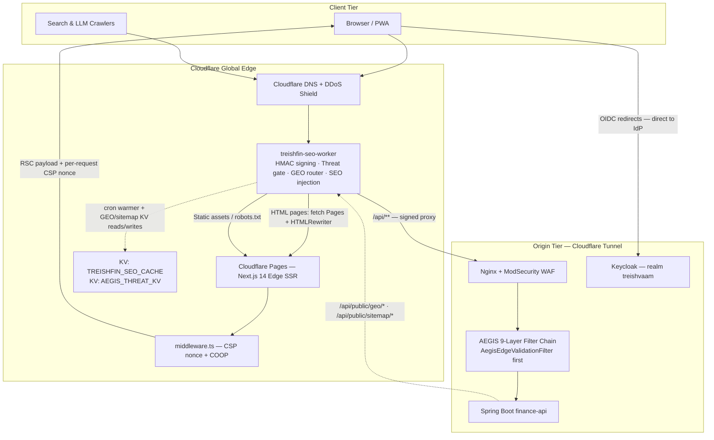

# FE-01 — Application Architecture (Next.js 14 App Router on Cloudflare Pages)

**Project:** `treishvaam-finance-frontend`
**Classification:** Internal — Engineering Reference
**Verified against:** `next.config.mjs`, `middleware.ts`, `package.json` / `package-lock.json`, `app/layout.tsx` structure, `src/sw.ts`, FIN-01 (verified 2026-05-29)

---

## 1. Executive Summary

The frontend is a **thin-server / thick-client hybrid** built on Next.js 14 App Router. A minimal React Server Component layer (`app/layout.tsx`, `generateMetadata()` routes, GEO route handlers) executes on the **Cloudflare Edge Runtime**; the substantive application — 150+ components in `src/` — is client-rendered React inherited from the CRA migration. The `treishfin-seo-worker` (FE-02) sits in front of everything, so the Next.js layer never receives raw public traffic.

> [!IMPORTANT]
> ### Hosting Model — Static Export → Edge SSR
> The Master Blueprint describes the frontend as "deployed statically on Cloudflare Pages." This was **Phase 1 of the migration** and is **no longer current**. Per `next.config.mjs` (immutable history: *"Removed `output: 'export'` to upgrade to Cloudflare Next.js Edge SSR"*) and FIN-01 (verified 2026-05-29), production runs **Cloudflare Pages Edge SSR** driven by `export const runtime = 'edge'` in `app/layout.tsx`. The Edge SSR mode is mandatory because `headers()` (CSP nonce consumption) forces dynamic rendering. **Never re-add `output: 'export'`** — it breaks nonce-based CSP and dynamic `generateMetadata()`.

## 2. Runtime & Dependency Stack (Verified)

| Component | Version | Role |
| :--- | :--- | :--- |
| Next.js | ^14.2.35 | App Router, Edge SSR, middleware |
| React / React DOM | ^18.3.1 | UI runtime |
| keycloak-js | ^25.0.0 | OIDC client (upgraded from ^23.0.0 for Keycloak 25 nonce compatibility — see FE-04) |
| @tiptap/* | ^3.23.1 | Rich-text editor (replaced SunEditor) |
| @grafana/faro-web-sdk / -tracing | ^2.0.2 | RUM + distributed tracing |
| @serwist/next + serwist | ^9.0.2 | PWA service worker |
| @fontsource-variable/inter | ^5.1.0 | Self-hosted variable font |
| lightweight-charts / recharts | ^4.1.3 / ^3.8.1 | Financial charting |
| axios / dompurify / hls.js | ^1.6.7 / ^3.0.8 / ^1.7.0 | HTTP, sanitization, HLS video |
| tailwindcss (+ @tailwindcss/typography) | ^3.4.1 / ^0.5.19 | Styling |
| react-dnd, react-image-crop, react-slick, html2canvas | — | Editor & media UX |
| typescript (dev) | 6.0.3 | Type checking (build errors intentionally deferred — see §9) |
| react-helmet-async (legacy) | ^2.0.4 | Residual CRA-era SEO — being replaced by `metadata` exports |

**Package discipline:** Production builds use **`npm ci`** exclusively. `package-lock.json` must always be committed in lockstep with `package.json` — desync crashes Cloudflare Pages builds.

## 3. End-to-End Request Lifecycle

Key property: the **browser never talks to the backend directly**. Every `/api/**` call from client code resolves to the same origin, is intercepted by the Worker, signed, and forwarded. This is AEGIS Layer 4 enforcement (see FE-02 §5).

## 4. Dual-Layer Component Model (Migration Architecture)

| Layer | Technology | Routing | Purpose |
| :--- | :--- | :--- | :--- |
| `app/` | TypeScript, App Router | **Is** the URL surface | Thin server wrappers: `metadata` exports, `generateMetadata()`, route handlers, layout chrome |
| `src/` | JavaScript (CRA legacy) | **Not** routes — imported components | Full application logic, contexts, widgets |

Supporting mechanisms:

- **`pageExtensions: ['tsx', 'ts']`** — hard guarantee that `src/pages/*.js` can never become routes.
- **`src/utils/react-router-shim.js`** — maps `useNavigate` / `useParams` / `Link` from react-router-dom semantics onto Next.js `next/navigation`. **Do not remove** until all `src/pages/*.js` are natively migrated.
- **Dead code:** `src/App.js` and `src/index.js` are unused CRA entry points (harmless; scheduled for removal).

## 5. Rendering Strategy & RSC Boundaries

| Boundary | Execution | Examples |
| :--- | :--- | :--- |
| **Server (Edge)** | RSC on Cloudflare Pages | `app/layout.tsx` (reads `x-nonce` via `headers()`), `terms/vision/about` wrappers (`export const metadata`), `app/category/...` (`generateMetadata()` with Edge fetch incl. `X-Tenant-ID: finance`), GEO route handlers |
| **Middleware (Edge)** | Pre-render | `middleware.ts`: nonce generation, CSP header, `/home`→`/` 301 |
| **Client** | Hydrated React | Everything under `src/` (`"use client"`), providers, dashboard, editor, market widgets |

**Hydration safety invariants (non-negotiable):**

1. `suppressHydrationWarning` on `<html>` and `<body>` — prevents crashes from `ThemeProvider` localStorage reads and async Keycloak DOM mutation.
2. Deterministic initial state in all contexts (`useState(false)` / `'light'` / `[]`), with `mounted` flags flipping only inside `useEffect` — the standard SSR/CSR parity pattern used by `SmartMediaRenderer`, `ThemeContext`, `WatchlistContext`, `FloatingDockContext`.
3. `AuthContext` uses a **global singleton shield** (`globalKeycloak` / `globalInitPromise`) so React 18 remounts attach to the live OAuth promise instead of burning the authorization code (full detail in FE-04).

## 6. Middleware & Header Layer

`middleware.ts` (Edge-safe — uses `btoa(crypto.randomUUID())`, **never `Buffer`**):

- Generates a per-request CSP nonce; forwards it to `layout.tsx` via the `x-nonce` request header; embeds it in `Content-Security-Policy`.
- `'unsafe-inline'` and `'unsafe-eval'` are **prohibited** in `script-src`/`style-src` — nonce + `'strict-dynamic'` only.
- `silent-check-sso.html` is matcher-exempt (static Keycloak iframe cannot receive the dynamic nonce).
- Cross-origin policy: `Cross-Origin-Opener-Policy: same-origin-allow-popups` (Keycloak silent-SSO `postMessage` requirement); CORP deleted at middleware level, set to `same-site` globally in `next.config.mjs` `headers()`.

## 7. Asset Pipelines

### 7.1 Images — Custom Cloudflare Loader

`next.config.mjs` sets `loader: 'custom'` → `src/utils/cloudflareImageLoader.ts`, delegating resize to the Cloudflare CDN. Native Next.js image optimization crashes on Cloudflare Pages Edge. **Never revert to native optimization.** `remotePatterns` whitelists any HTTPS host (`https://**`), with authenticated media gated at the component layer via `AuthImage` / `ResponsiveAuthImage` (MinIO presigned URLs).

### 7.2 Fonts

Self-hosted `@fontsource-variable/inter`, imported in `layout.tsx` with a mandatory `// @ts-ignore` (Cloudflare strict TS checker rejects side-effect imports without `.d.ts`).

### 7.3 PWA — Serwist

`src/sw.ts` → compiled to `public/sw.js` by `@serwist/next` (disabled in development).

| Resource | Strategy |
| :--- | :--- |
| API responses | `NetworkFirst` (freshness) |
| Static assets | `CacheFirst` (offline reliability) |
| HTML pages | `StaleWhileRevalidate` |

Build constraints: line 1 must be `/// <reference lib="webworker" />`; handlers must be **instantiated classes** (`new NetworkFirst()`), never string handlers — strings cause fatal `RouteHandler` type errors.

### 7.4 Third-Party Scripts

`ThirdPartyScripts.js` defers GA4/Ads/AdSense injection until first interaction (scroll / mousemove / touchstart / 7-second idle fallback) → **0 ms Thread-Blocking Time**. All IDs come from `NEXT_PUBLIC_*` env vars; hardcoding publisher IDs is prohibited.

## 8. Observability Hooks (Frontend)

- **Grafana Faro** (`src/faroConfig.js`): LCP/FID/CLS/FCP/TTFB, unhandled exceptions, network errors → internal Loki/Tempo stack. Error boundaries must not bypass Faro.
- **`WebVitalsTracker.tsx`**: web-vitals reporting (`'use client'`).
- **`AegisTelemetry.tsx`**: L5-BIE behavioral hashing → `/api/v1/aegis/telemetry` (FE-04 §7).

## 9. Build-Time Leniency Flags (Intentional)

`eslint.ignoreDuringBuilds: true` and `typescript.ignoreBuildErrors: true` — deliberate resilience measure so the Cloudflare Pages compiler never aborts on type-inference warnings. Type safety is enforced at local dev/IDE time. This is a documented trade-off, not negligence.

## 10. Known Technical Debt Register

| Item | Location | Severity |
| :--- | :--- | :--- |
| Dead CRA entry points `App.js`, `index.js` | `src/` | Low |
| `react-helmet-async` legacy usage in unmigrated `src/pages/*` | `package.json` | Low |
| Stale `homepage` field referencing legacy domain | `package.json` | Low |
| `PostCard.js` imports `react-router-dom` directly while the dependency is absent from `package.json` | `src/components/BlogPage/PostCard.js` | Medium — verify whether component is reachable; sibling cards migrated to `next/link` |
| Root `wrangler.toml` coexists with canonical `worker/wrangler.toml` | repo root | Low — ⚠ Requires clarification on root file's purpose |

## 11. Cross-References

- Worker request pipeline, HMAC signing, threat gating → **FE-02**
- State, API consumption, bridge contract mapping → **FE-03**
- Auth, CSP, sanitization → **FE-04**
- Build/deploy specifics → **FE-07**
