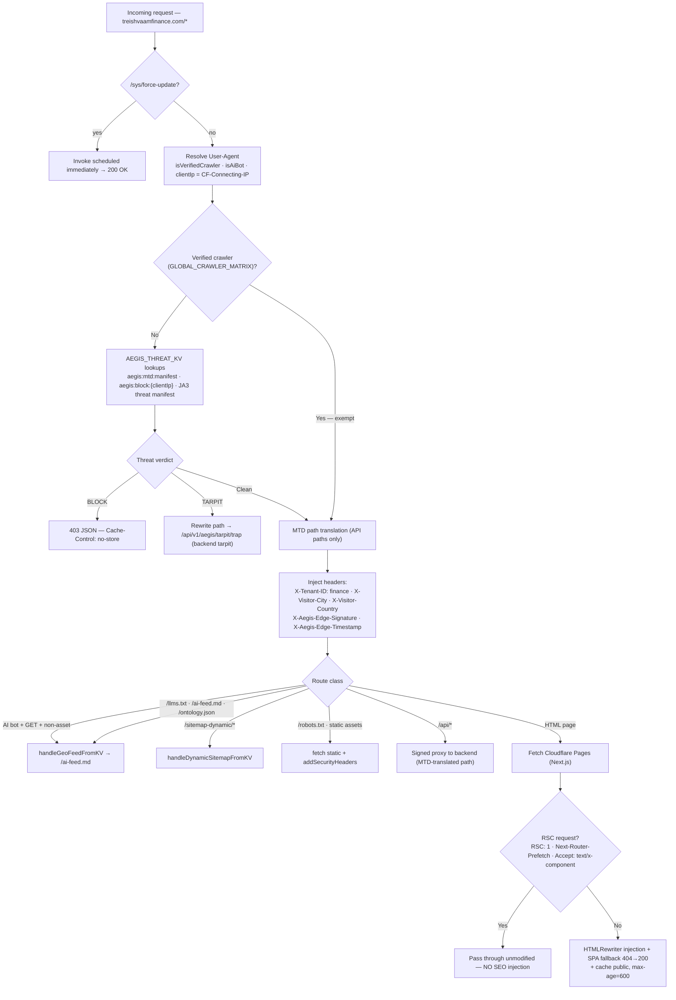
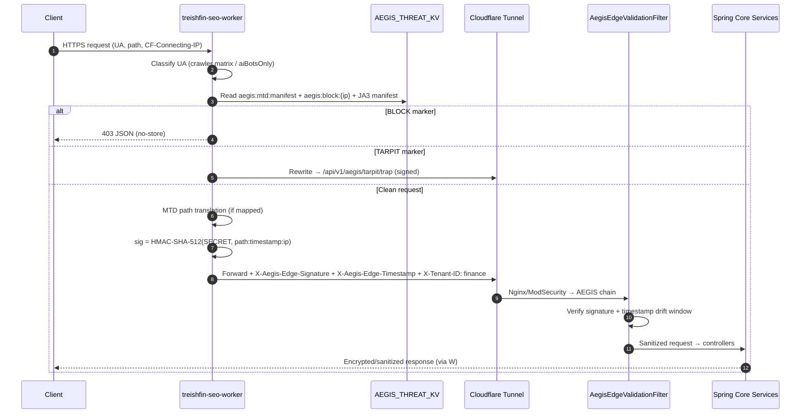

# FE-02 — Cloudflare Edge Worker Ecosystem (AEGIS Edge Layer)

**Project:** `treishvaam-finance-frontend` — Worker: `treishfin-seo-worker`
**Route:** `treishvaamfinance.com/*` (sole HTTP entry point)
**Classification:** Internal — Sanitized (no KV IDs, no signing keys)
**Verified against:** `worker/worker.js` (616 lines), `worker/wrangler.toml`, FIN-03 (verified 2026-05-29), Enterprise Architecture Strategy §1–2

---

## 1. Overview & Roles

The Worker is a single-file V8-isolate Cloudflare Worker performing six concurrent roles:

| Role | Responsibility |
| :--- | :--- |
| **Zero-Trust API Proxy** | HMAC-SHA-512 signs every backend request; injects tenant/geo headers |
| **AEGIS L4-ADA Checkpoint** | Reads KV threat manifests; blocks or tarpits malicious IPs/JA3 hashes |
| **GEO Router** | Intercepts LLM crawlers; serves KV-cached semantic payloads; bypasses React entirely |
| **SEO Intelligence Layer** | Injects JSON-LD/meta via `HTMLRewriter`; SPA-fallback prevents 404 SEO penalties |
| **Cron Cache Warmer** | Hourly proactive KV sitemap refresh via `scheduled()` |
| **Asset & Static Proxy** | Passes static assets with `Cache-Control` and security headers |

## 2. Configuration & Bindings

```toml
# worker/wrangler.toml (verified)
name = "treishfin-seo-worker"
main = "worker.js"
compatibility_date = "2024-01-01"

[[kv_namespaces]]
binding = "TREISHFIN_SEO_CACHE"   # GEO + sitemap payloads

[[kv_namespaces]]
binding = "AEGIS_THREAT_KV"       # Block/tarpit manifests + MTD route map

[triggers]
crons = ["0 * * * *"]             # Hourly sitemap warmer

[vars]
NEXT_PUBLIC_ENFORCE_STRICT_PRIVACY = "false"
```

> [!WARNING]
> **Worker Secrets — never in `wrangler.toml` or git.** Injected via `npx wrangler secret put`:
> - `AEGIS_EDGE_SECRET` — HMAC-SHA-512 seed. **Must match the backend's `AEGIS_EDGE_SECRET` byte-for-byte.** Mismatch = every proxied request rejected by `AegisEdgeValidationFilter`.
> - `BACKEND_API_URL` — Cloudflare Tunnel URL to Spring Boot backend.
> - `BACKEND_URL` — fallback alias when `BACKEND_API_URL` is absent.

> [!NOTE]
> **KV namespace IDs:** the committed `worker/wrangler.toml` legitimately contains `id` and `preview_id` for both namespaces. Cloudflare KV namespace IDs are non-secret account identifiers (standard IaC practice — required for `wrangler deploy`); this document redacts them as an extra hygiene layer only. The `[vars]` block is IaC-enforced (Phase 6.2 history): the Cloudflare dashboard locks plaintext variables when a wrangler.toml is present.

### 2.1 Cloudflare Tunnel Ingress (`worker/config.yml` — verified)

`cloudflared` tunnel config (tunnel `849d7408-…`, protocol http2):
`backend.treishvaamgroup.com` → `http://treishvaam-nginx:80`, catch-all → 404.
Authentication via the `TUNNEL_TOKEN` environment variable — no credentials file in git.
This file configures the **host-side cloudflared daemon**: ingress changes require a
cloudflared service restart on the production host, **not** `wrangler deploy`. Never delete.

## 3. Request Processing Pipeline



**RSC bypass guard (immutable):** The SEO Intelligence block is wrapped in `if (!isRscRequest)`. Applying `HTMLRewriter` to RSC binary streams caused 500 errors. Never remove this guard.

## 4. Crawler Matrix (Compiled Once Per Isolate)

Two RegExp objects compile at module load — zero per-request regex cost.

- **`GLOBAL_CRAWLER_MATRIX`** — 50+ verified bots across: search engines (Googlebot, Bingbot, DuckDuckBot, Baiduspider, YandexBot…), Google ecosystem (Googlebot-News/Image/Video, Google-Extended, AdsBot…), AI/LLMs (GPTBot, ChatGPT-User, OAI-SearchBot, ClaudeBot, anthropic-ai, PerplexityBot, DeepSeek, Bytespider, Qwen, Mistral, YouBot, Cohere-training, Diffbot…), social unfurl (Twitterbot, facebookexternalhit, LinkedInBot, Slackbot, Discordbot, TelegramBot, WhatsApp, Pinterestbot, Redditbot), news/feed readers, archivers, and the internal `Treishvaam-Worker-Crawler`.
- **`aiBotsOnly`** — the AI/LLM subset, used exclusively for GEO interception.

> [!NOTE]
> **Indexability invariant:** Bots matching `GLOBAL_CRAWLER_MATRIX` **bypass AEGIS threat evaluation entirely** to guarantee search indexability. AI bots additionally route to GEO payloads instead of React HTML.

## 5. HMAC-SHA-512 Edge Signing — `generateEdgeSignature()`

**The most critical security function in the Worker.** Every request forwarded to the backend must carry a valid AEGIS Edge Signature, enforced by the backend's `AegisEdgeValidationFilter` (AEGIS Layer 4). Unsigned direct-to-origin traffic is discarded with zero response body.

```
signature = HMAC-SHA-512(
    key  = AEGIS_EDGE_SECRET,
    data = `${pathname}:${timestamp}:${clientIp}`
)
→ hex(signature)     in X-Aegis-Edge-Signature header
→ unix epoch (s)     in X-Aegis-Edge-Timestamp header
```

**Centralized helper — do not inline (immutable rule):** `generateEdgeSignature(path, timestamp, ip, secret)` is a shared function invoked by:

1. Main `fetch()` handler (every forwarded request)
2. `scheduled()` cron handler
3. `handleGeoFeedFromKV()` on KV cache miss
4. `handleDynamicSitemapFromKV()` on KV cache miss
5. SEO intelligence hydration fetches (`/category/`, `/market/` SSR data)

Historical incident: before centralization, the cron and cache-miss paths signed stale/incorrect paths, causing 403 rejections at `AegisEdgeValidationFilter`. Re-inlining or duplicating this logic reintroduces that failure mode.

**WebCrypto note:** the Edge uses WebCrypto HMAC-SHA-512 (SHA-512 is natively supported; SHA3-512 is not). The backend filter (BouncyCastle) accepts HMAC-SHA-512 — a documented, accepted asymmetry.

> [!NOTE]
> **Contract reconciliation (flagged, not resolved here):** The Enterprise Architecture Strategy (§2, Layer 4) describes the backend validation input as `RequestTimestamp + Method + Path + BodyHash` and the bridge header names as `X-AEGIS-Signature` / `X-AEGIS-Timestamp`, with a ±30 s drift window. The **verified Worker implementation** signs `${pathname}:${timestamp}:${clientIp}` and emits `X-Aegis-Edge-Signature` / `X-Aegis-Edge-Timestamp`. Worker and filter are deployed as a matched pair; the canonical algorithm is whatever `BE-02-SECURITY.md` documents for `AegisEdgeValidationFilter`. **Any change to signing inputs must be synchronized across `worker.js`, `BE-02`, and `CROSS-SYSTEM-CONTEXT.md` in the same release.**

## 6. JA3 Fingerprinting & AEGIS Threat Evaluation

The Worker is the client-side enforcement point of AEGIS **L4-ADA** (Layer 3 of the 9-layer framework) and **MTD** (Layer 9):

1. **MTD manifest** — reads `aegis:mtd:manifest` from `AEGIS_THREAT_KV` (the time-sliced route translation map synchronized from backend Redis via `CloudflareEdgeSyncService`). If the incoming API path matches a manifest entry, it is translated before signing/forwarding.
2. **IP blocklist** — reads `aegis:block:{clientIp}`:
   - `BLOCK` marker → instant 403 JSON, `Cache-Control: no-store`.
   - `TARPIT` marker → path rewritten to `/api/v1/aegis/tarpit/trap`, handing the connection to the backend tarpit engine (synthetic responses, ~1 byte/sec streaming honeypots).
3. **JA3 TLS fingerprint hashes** — the threat manifests include JA3-hash entries consulted during threat evaluation, blocking or tarpitting known malicious TLS client fingerprints regardless of rotating IPs.
4. **Verified crawler exemption** — matrix-matched UAs skip threat evaluation (§4).

**Backend sync path:** backend `AegisDeceptionEngine` publishes attack telemetry to RabbitMQ (`aegis.attack.telemetry`); the edge-sync pipeline (with `localBlockCache` dedup to minimize free-tier KV writes) populates `AEGIS_THREAT_KV`.

⚠ **Requires clarification:** the exact KV key format for JA3 entries and the acquisition mechanism for the JA3 hash inside the Worker (e.g., Cloudflare TLS fingerprint fields) are not fully visible in the provided excerpts of `worker.js`; verify against the full source before modification.

## 7. Signed Request Lifecycle (End-to-End)



## 8. GEO Handler — `handleGeoFeedFromKV()`

Three-tier delivery cache for LLM-facing payloads:

| Tier | Store / Key | TTL / Cache-Control |
| :--- | :--- | :--- |
| 1. CDN Edge Cache | `caches.default` | fastest — 0 ms KV read on hit |
| 2. KV | `geo:finance:/llms.txt` · `geo:finance:/ai-feed.md` · `geo:finance:/ontology.json` | written on backend hit, `expirationTtl: 86400`; served with `public, s-maxage=86400, max-age=3600` |
| 3. Backend fallback | `BACKEND_API_URL` + `/api/public/geo{path}` | miss/error → `503 GEO Feed Unavailable` |

AI-bot responses carry **`X-GEO-Bot-Detected: true`**. Aggressive interception: AI bots requesting any HTML GET are redirected to `/ai-feed.md` (skipping React entirely).

## 9. Dynamic Sitemap Pipeline

- KV meta key: `sitemap:finance:meta` → `{"markets":["/sitemap-dynamic/market/0.xml"],"blogs":["/sitemap-dynamic/blog/0.xml"]}` (TTL 90000).
- Per-sitemap keys: `sitemap:finance:/sitemap-dynamic/{blog|market}/N.xml` (TTL 90000).
- Path translation on backend fetch: `/sitemap-dynamic/X` → `/api/public/sitemap/X`.

**Cron (`scheduled()`, hourly):** fetch `/api/public/sitemap/meta` (signed) → write meta to KV → for the first 5 sitemap paths: translate, **generate a fresh signature for the translated path**, fetch XML, write to KV. Client IP for cron signatures is `127.0.0.1` (loopback), which the backend filter exempts.

## 10. SEO Intelligence Injection (HTMLRewriter)

All injections guarded by `!isRscRequest`:

| Route | Injection |
| :--- | :--- |
| `/`, `/home` | WebSite JSON-LD schema + GEO discovery links (`/llms.txt`, `/ontology.json`) |
| `/about`, `/vision` | Static title/description meta + GEO links |
| `/category/{cat}/{slug}/{id}` | Backend post fetch → inject `<title>`, `meta[description]`, `window.__PRELOADED_STATE__`, GEO links |
| `/market/{ticker}` | Backend market fetch → ticker title + `window.__PRELOADED_STATE__`, GEO links |

`window.__PRELOADED_STATE__` is serialized via `safeStringify()` (escapes `<`, `>`, `&`) — XSS hardening for JSON-in-HTML injection. Full SEO strategy: FE-06.

## 11. Security Headers — `addSecurityHeaders()`

Applied to all proxied HTML/API responses:

```
Strict-Transport-Security: max-age=63072000; includeSubDomains; preload
X-Content-Type-Options: nosniff
X-XSS-Protection: 1; mode=block
Referrer-Policy: strict-origin-when-cross-origin
Permissions-Policy: geolocation=(), microphone=(), camera=(), payment=()
Cross-Origin-Opener-Policy: same-origin
Cross-Origin-Resource-Policy: same-site
X-Permitted-Cross-Domain-Policies: none
```

Also: `Content-Security-Policy-Report-Only` is deleted; SPA fallback overrides 404→200 when `X-SPA-Fallback` is present; HTML cached `public, max-age=600`; on origin 5xx the CDN cache is served if available.

> [!NOTE]
> **Documented COOP asymmetry:** the Worker sets `Cross-Origin-Opener-Policy: same-origin` on proxied responses, while `middleware.ts` sets `same-origin-allow-popups` for the Next.js layer (Keycloak silent-SSO `postMessage` requirement). The two values are intentional per layer; coordinate any change with FE-04 §8.

## 12. Operations

- **Manual cache refresh (production emergency):** `GET https://treishvaamfinance.com/sys/force-update` — invokes `scheduled()` immediately.
- **Deployment rule (immutable):** run `npx wrangler deploy` from `worker/` **only** when `worker.js` or `worker/wrangler.toml` changed — and **before** pushing frontend changes that depend on it. Never deploy the Worker for pure frontend changes.

## 13. Known Gaps

- **Agro Worker parity:** `treishvaamagro-seo-worker` has **not** received the AEGIS Phase 6 upgrades (centralized signing helper, crawler matrix, GEO interception, MTD translation, `AEGIS_THREAT_KV` integration). The Finance `worker.js` logic must be mirrored into the Agro worker (substituting `BACKEND_ORIGIN`/`CF_PAGES_ORIGIN` secrets) when that frontend finalizes.

## 14. Open Items — Requires Clarification

| # | Item |
| :--- | :--- |
| 1 | Exact JA3 KV key format and hash acquisition mechanism in the Worker (§6) |
| 2 | Reconciliation of HMAC input composition between Worker and backend filter (§5) |
| 3 | Whether `X-Request-ID: UUIDv4` (bridge contract) is emitted by the Worker — not visible in provided excerpts |
