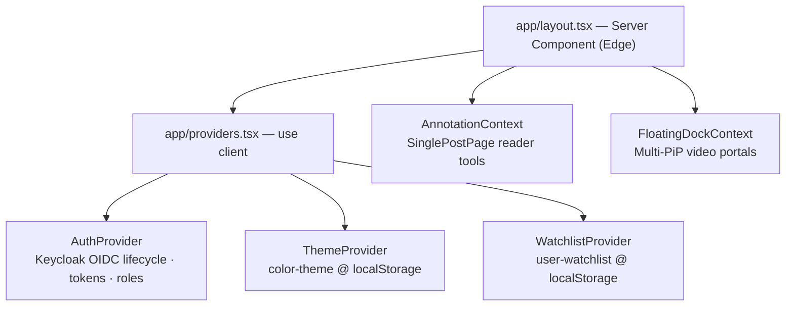

# FE-03 — State & Data Management (Client State, API Consumption, Real-Time Data)

**Project:** `treishvaam-finance-frontend`
**Classification:** Internal — Engineering Reference
**Verified against:** `src/context/AuthContext.js`, `ThemeContext.js`, `WatchlistContext.js`, `FloatingDockContext.js`, `src/hooks/useManagePosts.js`, `src/apiConfig.js` (per FIN-02 §9), market/news component imports, Enterprise Architecture Strategy §8 (bridge contract specification)

---

## 1. State Philosophy

The application deliberately avoids heavyweight state libraries (no Redux/Zustand/tanstack-query in the dependency tree). State is partitioned into:

1. **Server-adjacent state** — fetched via a single Axios instance (`apiConfig.js`), held in local component state.
2. **Cross-cutting client state** — five React Contexts mounted by `app/providers.tsx`.
3. **Persistent local state** — `localStorage` (preferences, watchlist) and `sessionStorage` (auth circuit breakers).
4. **Edge/CDN state** — KV + cache tiers owned by the Worker (FE-02 §8–9).

## 2. Provider Architecture

| Context | Persistence | Exposed API | Hydration Pattern |
| :--- | :--- | :--- | :--- |
| `AuthContext` | keycloak-js token store + `sessionStorage` breakers | `{ auth: { user, isAuthenticated, token, fatalError, fatalErrorMsg }, login, logout, loading }` | `loading: true` initial; global singleton shield for remounts |
| `ThemeContext` | `localStorage['color-theme']` | `{ theme, toggleTheme }` | deterministic `'light'` initial; localStorage read post-mount |
| `WatchlistContext` | `localStorage['user-watchlist']` | `{ watchlist, addToWatchlist, removeFromWatchlist, toggleWatchlist, isInWatchlist }` | deterministic `[]`; JSON.parse post-mount |
| `AnnotationContext` | In-memory (session-scoped reader tools) | tools, highlights, strokes, undo/redo stacks, notes, typography, audio state | consumer components use `mounted` shields |
| `FloatingDockContext` | In-memory | `{ pinnedVideos, pinVideo, unpinVideo }` + portal container | `mounted` shield; native Pointer Events dragging (no drag library — bundle-size mandate) |

## 3. API Consumption Layer — `src/apiConfig.js`

Single Axios instance; all backend communication flows through it.

- **Base URL:** `process.env.NEXT_PUBLIC_API_URL` — never hardcoded.
- **Auth attachment:** Keycloak JWT attached as `Authorization: Bearer <token>` via `setAuthToken()`.
- **Interceptor:** on 401 → token refresh → single retry.
- **Tenant isolation:** server-side and Worker-initiated fetches carry `X-Tenant-ID: finance`; browser-originated calls reach the backend through the Worker proxy, which injects/validates tenant + signature headers (FE-02 §5).

### 3.1 Verified API Function Catalogue (by import evidence)

| Function | Consumed by | Domain |
| :--- | :--- | :--- |
| `setAuthToken`, `getUserProfile` | `AuthContext` | Auth / profile enrichment |
| `searchPosts` | `SearchAutocomplete` | Search (Elasticsearch-backed `/api/v1/search/query`) |
| `getNewsHighlights`, `getArchivedNews` | `NewsTabMobile`, news widgets | News |
| `getMostActive`, `getTopGainers`, `getTopLosers` | `MarketSlideMobile`, `TopMoversCard` | Market |
| `getAllPostsForAdmin`, `getDrafts`, `getCategories` | `useManagePosts` | Admin content |
| `deletePost`, `duplicatePost`, `bulkDeletePosts` | `useManagePosts` | Admin mutations |
| Blog CRUD, analytics, file upload, market detail functions | per FIN-02 §9 | Broad (exact signatures: `CROSS-SYSTEM-CONTEXT.md`) |

### 3.2 Direct Endpoint References (verified in components/docs)

`/api/v1/analytics`, `/api/v1/analytics/realtime`, `/api/v1/status`, `/api/v1/files/upload`, `/api/v1/search/query`, `/api/v1/news-highlights/ticker`, `/api/v1/aegis/telemetry`, `/api/v1/aegis/tarpit/trap` (Worker-only), `/api/v1/uploads/...` (media), `/api/public/geo/*`, `/api/public/sitemap/*`.

## 4. Bridge Contract Mapping (`CROSS-SYSTEM-CONTEXT.md`)

The bridge file is the canonical source for payload schemas. Mapping of its contract surface to frontend implementation:

| Bridge Contract Item | Frontend Implementation | Status |
| :--- | :--- | :--- |
| `X-AEGIS-Signature` / `X-AEGIS-Timestamp` (HMAC-SHA-512) | Injected exclusively by `treishfin-seo-worker` (`generateEdgeSignature()`) — **never** by browser code | ✅ Verified (FE-02 §5) |
| `X-Request-ID` (UUIDv4) | Not generated in provided frontend code | ⚠ Requires clarification (likely Worker or Nginx emission) |
| `Authorization: Bearer JWT` | Axios interceptor via `setAuthToken()` | ✅ Verified |
| `POST /api/v1/auth/login` · `POST /api/v1/auth/refresh` | Not called directly — token acquisition/refresh handled by `keycloak-js` OIDC (realm `treishvaam`, client `finance-app`) against the Keycloak IdP that fronts these flows | ✅ Verified (equivalent flow, see FE-04) |
| HttpOnly Strict Cookies | Keycloak session cookies are HttpOnly (IdP-managed); API auth uses Bearer headers | ✅ Verified — analysis in FE-04 §3 |
| `GET /api/v1/market/quote` · `GET /api/v1/market/history` | Market widgets via `apiConfig` functions (`getMostActive`, `getTopGainers`, `getTopLosers`, index/chart data) | ✅ Verified at function level; endpoint mapping per bridge |
| WebSocket `/ws/market` | Channel defined by bridge; market components in provided excerpts consume **REST** functions | ⚠ Requires clarification — no live WS client subscription visible in provided code |
| `GET /api/v1/posts` · `GET /api/v1/posts/{slug}` | Blog feed + `SinglePostPage` fetch flows | ✅ Verified behaviorally |
| `POST /api/v1/posts` (Admin + ZKP) | BlogEditor publish flow (`PublishPanel`, `version` optimistic lock) | ✅ Publish flow verified; ZKP is server-enforced — no client proof generation in provided code (FE-04 §2.1) |

## 5. Data Fetching Patterns (Canonical Examples)

1. **Debounced search** — `SearchAutocomplete`: 300 ms debounce, >1 char, keyboard-navigable results, navigates to `/category/{catSlug}/{userFriendlySlug}/{urlArticleId}`.
2. **Parallel independent fetches with isolated failure containment** — `NewsTabMobile`: highlights and archive fetched with individual `.catch()` so one failure never blocks the other.
3. **Batch admin fetch** — `useManagePosts`: `Promise.all([getAllPostsForAdmin(), getDrafts(), getCategories()])`, then Map-dedup by `id` merging posts + drafts.
4. **Optimistic mutations** — delete/bulk-delete filter local state immediately; duplicate triggers full refetch.
5. **Derived data memoization** — filtering, search, sorting, and pagination computed in `useMemo` over raw data; URL hash (`#drafts`/`#scheduled`/`#published`) mirrors view state.
6. **Post-hydration enrichment** — `AuthContext.syncProfileData()`: Keycloak claims first, then `getUserProfile()` overlay (display name) + Faro user instrumentation.

## 6. Real-Time & Streaming Data

| Channel | Mechanism | Notes |
| :--- | :--- | :--- |
| Market REST | Polling via `apiConfig` functions; auto-refreshing summary widgets | Verified |
| WebSocket `/ws/market` | Spring WebSocket pub/sub (backend); market tick broadcasts also fan out via RabbitMQ `market.data.ticks` internally | Client subscription implementation ⚠ Requires clarification (see §4) |
| HLS video | `hls.js` in `EnterpriseVideoPlayer`; `SmartMediaRenderer` locks grid/cover contexts to **360p** renditions (`master|1080p|720p|480p.m3u8 → 360p.m3u8`) for bandwidth economics | Verified |
| Multi-PiP | `FloatingDockContext` portals with native Pointer Events | Verified |

## 7. Client-Side Cache & Persistence Map

| Store | Keys | Purpose |
| :--- | :--- | :--- |
| `localStorage` | `color-theme`, `user-watchlist` | Preferences |
| `sessionStorage` | `kc_silent_sso_failed`, `kc_fatal_loop_breaker`, `kc_fatal_error_msg`, `kc_auth_retry`, `kc_login_lock_time`, `kc-*` (adapter keys) | Auth circuit breakers (FE-04 §6) |
| Service Worker (Serwist) | API `NetworkFirst` · static `CacheFirst` · HTML `StaleWhileRevalidate` | Offline/PWA (FE-01 §7.3) |
| Edge KV / CDN | `geo:finance:*`, `sitemap:finance:*`, `aegis:*` | Owned by Worker (FE-02) |
| Redis (backend) | market cache (TTL 1 h), token buckets, MTD keys (TTL 5 m) | Cross-ref BE-05 |

## 8. Error Handling & Degradation Doctrine

- **Guest-mode degradation:** auth failure never blocks content — public browsing is fully functional unauthenticated (verified: 25 s auth timeout → guest mode).
- **Fail-soft fetches:** news/archive failures return `{ data: [] }` rather than blank screens.
- **Telemetry:** unhandled exceptions and network errors stream to Grafana Faro; Web Vitals reported via `WebVitalsTracker`.
- **Auth hard-halt:** genuine cryptographic validation failures render a diagnostic halt screen instead of looping (FE-04 §6).
