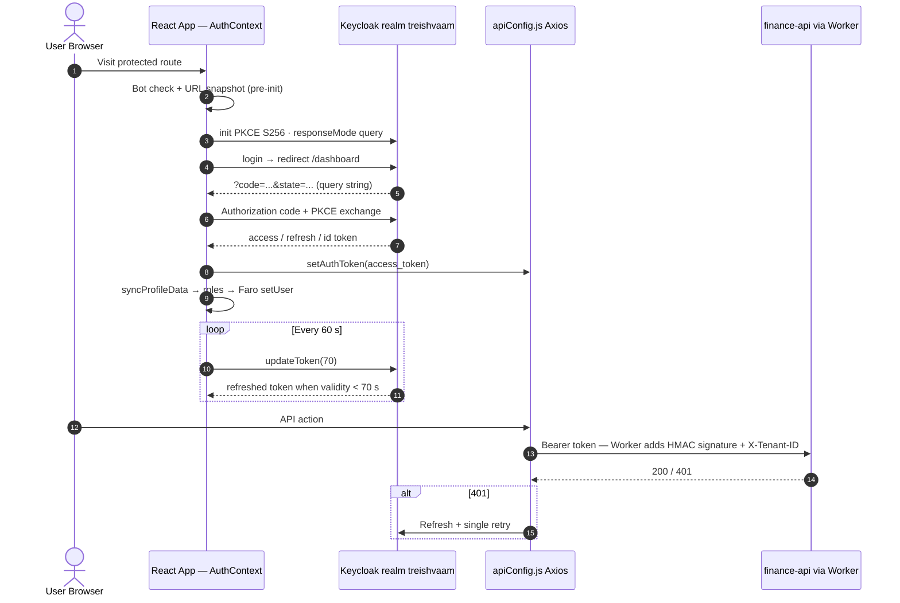

# FE-04 — Client-Side Security Integration (AEGIS Adherence, Authentication, CSP)

**Project:** `treishvaam-finance-frontend`
**Classification:** Internal — Engineering Reference — **Security-Critical**
**Verified against:** `middleware.ts`, `next.config.mjs`, `src/context/AuthContext.js` (full immutable history), `src/components/PrivateRoute.js`, `AegisTelemetry.tsx`, `src/lib/aegis-biometrics.ts` (per FIN-01/02), `dompurify` usage in `SinglePostPage`

---

## 1. Security Posture Summary

Client-side code is the **weakest link by definition** — it runs on hostile machines. The architecture therefore assigns trust progressively: the browser holds short-lived OIDC tokens and performs UX-level gating; the Edge Worker performs transport-trust (HMAC signing, threat gating); the backend performs all authoritative validation (AEGIS 9 layers). The frontend's contract is to **never weaken** what the Edge and backend enforce.

### 1.1 AEGIS Layer → Frontend/Edge Touchpoint Map

| AEGIS Layer | Touchpoint in this Tier |
| :--- | :--- |
| L1 — PQC (Dilithium5) | Backend-enforced on root identity/admin tokens. No client-side PQC code exists or is required. |
| L2 — ZKP Admin Gating | Enforced server-side on `/api/v1/admin/**` via Go ZKP microservice. No client proof generation in provided frontend code — ⚠ Requires clarification on the admin-console interaction path. |
| L3 — L4-ADA Deception | Worker KV block/tarpit gating (FE-02 §6); clients see 403 or tarpit behavior only. |
| L4 — Edge Signatures | Worker `generateEdgeSignature()` — sole signing authority. |
| L5 — Entropy/Behavioral | **`AegisTelemetry.tsx`** client-side biometric hashing (§7); backend `ShannonEntropyCalculator` remains authoritative. |
| L6 — PQC-JWT + RBAC | Keycloak realm roles (`realm_access.roles`) checked in `PrivateRoute`/dashboard gating; authoritative RBAC at backend. |
| L7 — Rate Limiting | Redis/Bucket4j at backend; no client-side limiter by design. |
| L8 — Sanitization | **DOMPurify** client-side render sanitization (§7) + backend dual-stage sanitization. |
| L9 — MTD | Worker temporal path translation via `aegis:mtd:manifest`. |

## 2. Authentication Architecture (Keycloak OIDC)

**Configuration (verified):** realm `treishvaam`, client `finance-app`, `url` from `NEXT_PUBLIC_AUTH_URL` (trailing-slash-stripped, HTTPS-forced except localhost), `pkceMethod: 'S256'`, `responseMode: 'query'`, `checkLoginIframe: false`, `useNonce: false`, `timeSkew: 86400`, `enableLogging: true`. Silent SSO via `/silent-check-sso.html`. Login redirect: `origin + '/dashboard'`.

### 2.1 Design Rationale (from immutable change history — condensed)

- **`useNonce: false`:** Keycloak 25 server changed nonce handling for authorization-code flows; older `keycloak-js` local nonce validation rejected otherwise-valid tokens. Client upgraded to `keycloak-js@^25.0.0` and disabled client-side nonce verification; the nonce integrity burden shifts to PKCE + TLS + server validation.
- **`responseMode: 'query'`:** Next.js App Router normalizes/strips URL hash fragments before component mount; fragment-mode codes were destroyed pre-exchange, causing infinite login loops.
- **`timeSkew: 86400`:** tolerates VM clock drift against browser-side temporal validation.
- **Global Singleton Shield:** `globalKeycloak`/`globalInitPromise` module-scope refs let a React 18 remount attach to the in-flight OAuth promise instead of consuming a burnt code twice.
- **Session Salvage:** on `CSP_BLOCK_OR_UNDEFINED` rejection, if `initKeycloak.token` was provisioned, the session is mounted anyway — breaking silent-SSO failure loops without accepting invalid tokens.

### 2.2 Token Lifecycle

| Phase | Behavior |
| :--- | :--- |
| Storage | keycloak-js adapter storage (session-scoped) + React state; **no custom `localStorage` token persistence** |
| Refresh | 60 s interval, `updateToken(70)`; refresh failure → logout |
| Transmission | `Authorization: Bearer` via Axios interceptor only |
| Logout | Keycloak logout + breaker-key cleanup + Faro `resetUser()` |

## 3. Cookie Strategy & CSRF Analysis

> [!NOTE]
> **Contract vs. implementation.** The bridge contract specification lists "HttpOnly Strict Cookies" among authentication contracts. In the implemented frontend: **Keycloak's own session cookies are HttpOnly** (IdP-managed, never touched by app JS), while **API authentication uses Bearer tokens**, not cookies. Because browsers do not auto-attach `Authorization` headers, the classic cookie-replay CSRF class is structurally mitigated for all `/api/**` calls. The CSP `form-action 'self'` further constrains cross-site form posts.
>
> ⚠ **Requires clarification:** whether the backend additionally issues/validates explicit CSRF tokens (e.g., double-submit cookie) for any cookie-bearing endpoint set not visible in the provided frontend code. No CSRF token acquisition/attachment logic exists in the provided frontend sources.

## 4. Route Protection & RBAC (UX-Level Gating Only)

`PrivateRoute.js` (client HOC) and `app/dashboard/layout.tsx` enforce **presentation-level** gating:

- Redirect to `/login?from=...` when `!loading && !isAuthenticated && !fatalError`, with a `hasRedirected` ref guard and `/login` prefix check preventing redirect loops.
- Distinct render states: loading verifier, fatal-error panel, `null` during redirect handoff.
- Role surface: `realm_access.roles`; `isAdmin = roles.includes('admin') || roles.includes('publisher')`. Page-level tiers (PUBLISHER+/EDITOR+/ADMIN) per FE-00 §4.
- **Invariant:** client gating is UX, not security — the backend re-validates every request through AEGIS L6.

## 5. Content Security Policy (Nonce-Based)

`middleware.ts` (Edge) generates `nonce = btoa(crypto.randomUUID())` per request:

- `script-src 'self' 'nonce-{n}' 'strict-dynamic' https://www.googletagmanager.com https://cloudflareinsights.com https://static.cloudflareinsights.com https://pagead2.googlesyndication.com`
- `style-src 'self' 'nonce-{n}' https://fonts.googleapis.com` · `font-src 'self' data: https://fonts.gstatic.com`
- `connect-src` locked to `*.treishvaamgroup.com`, `backend.treishvaamgroup.com`, GA endpoints, Cloudflare Insights, AdSense
- `frame-src 'self' *.treishvaamgroup.com backend.treishvaamgroup.com` · `frame-ancestors 'self'` · `object-src 'none'` · `base-uri 'self'` · `form-action 'self'` · `upgrade-insecure-requests`

> [!WARNING]
> **Non-negotiables:** `'unsafe-inline'` and `'unsafe-eval'` must never appear in `script-src`/`style-src`. `Buffer.from()` must never be used in middleware (Edge Runtime crash — use `btoa()`). The nonce must never be logged, stored, or reused. `silent-check-sso.html` is the sole, deliberate inline-script exemption (static Keycloak iframe cannot receive the dynamic nonce; blocking it traps users in `CSP_BLOCK_OR_UNDEFINED` auth loops).

## 6. Anti-Loop Circuit Breakers (SessionStorage)

| Key | Trigger | Effect |
| :--- | :--- | :--- |
| `kc_fatal_loop_breaker` (+ `kc_fatal_error_msg`) | Token exchange succeeded but local validation failed (nonce/issuer); or repeated `authentication_expired` | Hard-halt diagnostic screen; routing tree unmounted; init skipped next load |
| `kc_silent_sso_failed` | Silent SSO/iframe failure | Silent SSO disabled for session; guest mode |
| `kc_auth_retry` | `error=temporarily_unavailable&authentication_expired` | Exactly 1 forced fresh login retry, then breaker |
| `kc_login_lock_time` | React 18 Strict Mode double-invoked `login()` | 5 s temporal lock preventing nonce overwrite |

Breaker states clear on successful authentication or explicit user reset (`sessionStorage.clear()` → `/login`).

## 7. Input Sanitization & XSS Defense

| Vector | Defense |
| :--- | :--- |
| Tiptap-rendered article HTML | `DOMPurify.sanitize()` before insertion (`SinglePostPage`) |
| Worker JSON injection | `safeStringify()` escaping `<`, `>`, `&` in `window.__PRELOADED_STATE__` |
| Annotation/reader tools | Fully client-side; zero third-party script evaluation; snipping tool excludes `.treish-no-capture` elements |
| SSR SSG artifact | `#server-content` div removed on mount (stale-HTML purge) |

## 8. Consolidated Security Header Matrix

| Header | middleware.ts | next.config.mjs | Worker `addSecurityHeaders()` |
| :--- | :--- | :--- | :--- |
| Content-Security-Policy | ✅ nonce-based | — | Report-Only variant deleted |
| Cross-Origin-Opener-Policy | `same-origin-allow-popups` | `same-origin-allow-popups` | `same-origin` (documented asymmetry — FE-02 §11) |
| Cross-Origin-Resource-Policy | deleted | `same-site` | `same-site` |
| X-Permitted-Cross-Domain-Policies | `none` | `none` | `none` |
| HSTS / nosniff / XSS-Protection / Referrer-Policy / Permissions-Policy | — | — | ✅ full set |

## 9. AEGIS Client Telemetry (L5-BIE)

`AegisTelemetry.tsx` (`'use client'`, never SSR): passive mouse/scroll/keydown listeners; behavioral vectors hashed **client-side** via WebCrypto SHA3-256 (`src/lib/aegis-biometrics.ts`); only hashed entropy is transmitted to `POST /api/v1/aegis/telemetry`. Raw biometric vectors never leave the browser. Feeds backend behavioral/entropy engines (L5).

## 10. Secrets & Environment Hygiene

- Only `NEXT_PUBLIC_*` variables are legal (Next.js). `REACT_APP_*` is prohibited and non-functional.
- No API URL, backend origin, secret, or publisher ID may be hardcoded (LICENSE §2.4; enforced by convention and review).
- `.env` is git-ignored; only `.env.example` (value-free template) is committed. All production values live in Cloudflare Pages/Worker environment stores (FE-07 §4).
- Attempting to derive HMAC keys or Edge Signature seeds from the repository or traffic is an explicit license violation and an AEGIS-monitored attack pattern.

## 11. Compliance Notes

- GA4 defaults to **full IP retention** (Indian jurisdiction, DPDP Act 2023 posture) — never hardcode `anonymize_ip: true`. The `NEXT_PUBLIC_ENFORCE_STRICT_PRIVACY=true` env var activates anonymization without rebuild.
- `.well-known/security.txt` discloses the security contact channel.

## 12. Open Items — Requires Clarification

| # | Item |
| :--- | :--- |
| 1 | Explicit CSRF token mechanism (if any) for cookie-bearing endpoints (§3) |
| 2 | Client-side participation in ZKP admin gating (§1.1) |
| 3 | `X-Request-ID` generation point for browser-originated API calls |
