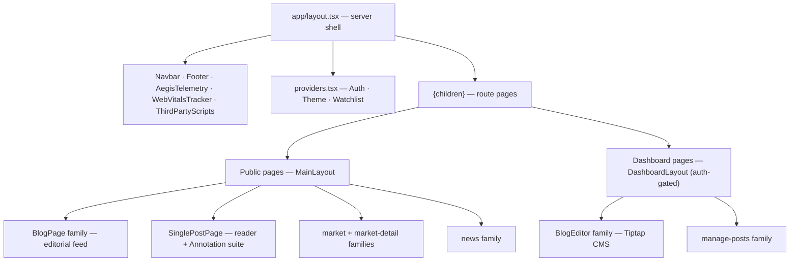

# FE-05 — Component Architecture & Design System

**Project:** `treishvaam-finance-frontend`
**Classification:** Internal — Engineering Reference
**Verified against:** `src/components/**` (Parts 3–5 excerpts), `src/pages/**`, FIN-02 (verified 2026-05-29), Tailwind class usage analysis across all provided components

---

## 1. Component Model

~150 components organized in domain families under `src/components/`, consumed by `app/` route wrappers and `src/pages/` legacy page components. Components are JavaScript (CRA legacy) with targeted TypeScript islands (`AegisTelemetry.tsx`, `WebVitalsTracker.tsx`, `aegis-biometrics.ts`, `cloudflareImageLoader.ts`).



## 2. Design Tokens

### 2.1 Color (observed system)

| Role | Tokens (observed usage) |
| :--- | :--- |
| Neutrals | `slate-50…950` (primary system), `gray-*` (legacy editorial surfaces) |
| Primary / accent | `sky-400…700` (links, active states, brand accents), `indigo-500` (plasma effects) |
| Positive | `emerald-400/500`, `green-*` |
| Negative / live | `red-400/500/600` (LIVE badges, destructive actions) |
| Attention | `amber-500` |
| Editorial overlay | `black/50–70` gradients, `white/10–40` glass tiers |

Dark mode is **class-strategy** (`dark:` variants; `ThemeContext` toggles `light`/`dark` on `<html>`).

### 2.2 Typography

- **Sans (UI):** Inter Variable (self-hosted). **Serif (editorial headlines/body):** `font-serif` throughout post cards, hero, feed.
- **Micro-label system:** `text-[9px]…[11px] font-bold/black uppercase tracking-widest` — the signature "wire-service" metadata style on dates, categories, sections.
- Headline scale: mobile `text-lg` → hero `text-3xl/4xl font-black`.

### 2.3 Signature Surface — "Liquid Glass"

Canonical glassmorphism object (from `RadarSidebar.js` — must remain inline-styled; Tailwind JIT has failed to reliably compile arbitrary backdrop filters):

```js
const liquidGlassStyle = {
  backgroundColor: 'rgba(255, 255, 255, 0.12)',
  backdropFilter: 'blur(40px) saturate(180%)',
  WebkitBackdropFilter: 'blur(40px) saturate(180%)',
  boxShadow: 'inset 0 1px 1px 0 rgba(255,255,255,0.4), inset 0 -1px 1px 0 rgba(255,255,255,0.1), 0 16px 36px -8px rgba(0,0,0,0.35)',
  border: '1px solid rgba(255, 255, 255, 0.25)'
};
```

### 2.4 Geometry, Motion & Media

- **Radii:** `rounded-sm` for editorial media (print-like) vs `rounded-xl…[28px]` for glass panels/buttons.
- **Motion:** spring easing `cubic-bezier(0.34,1.56,0.64,1)`; durations 300/500/700 ms; hover scale-105/110 transforms.
- **Aspect ratios:** `aspect-video` (hero/grid), `aspect-[4/3]` (cards).
- ⚠ **Requires clarification:** canonical `tailwind.config.js` theme-extension values — the file's contents were not included in the provided excerpts; tokens above are derived from verified component usage.

## 3. Component Family Reference

### 3.1 Layout Chrome
`Navbar` (search, auth state, theme toggle, mobile menu) · `Footer` · `MainLayout` · `DashboardLayout` (sidebar, auth-gated).

### 3.2 Blog Feed (`src/components/BlogPage/`) — Editorial Zone Orchestration

`editorialDistributor.js` partitions post arrays into layout zones by count thresholds:

| Zone | Components |
| :--- | :--- |
| Hero (LCP) | `HeroSection` (eager media, `SmartMediaRenderer`, optimized `sizes`) |
| Banner | `BannerPostCard` |
| Grid | `BlogGridDesktop`, `GridPostCard`, `FeedGridCard` |
| Featured | `FeaturedColumn` (sticky, wraps `NewsIntelligenceWidget`) |
| Feed variants | `FeedRowCard`, `FeedTextCard` |
| Navigation | `CategoryStrip` / `CategoryStripMobile` |
| Sidebars | `BlogSidebar`, `MarketSidebar` (Watchlist + IndexCharts + MarketMovers) |
| Mobile | `BlogSlideMobile`, `MobilePostCard`, `MarketSlideMobile` (tabbed), `NewsTabMobile` |

Card invariants: post link pattern `/category/{categorySlug}/{userFriendlySlug}/{urlArticleId}`; `formatDateTime` from `blogUtils`; `categoryStyles` class map; `line-clamp` truncation; `isNew` red-dot indicator.

### 3.3 Post Reader & Annotation Suite

`SinglePostPage` mounts: `TableOfContents` (H2/H3 scan) · `ReadingProgressBar` (sticky, defensive heading-array guards, −90 px scroll offset) · `ShareButtons`/`ShareModal` (react-share + clipboard) · `DeeperDive` (related carousel) · `RadarSidebar` (floating liquid-glass capsule: highlighter, pen with styles/colors/width, eraser, TTS narration with rate control, typography scaler 85–135%, floating calculator, snipping tool via `SnippingToolOverlay` + html2canvas, margin notes, focus dimmer, undo/redo stacks) · `AnnotatableProse` / `CanvasOverlay` / `HighlightEngine` / `FloatingCalculator`.

### 3.4 Market & Market-Detail

`market/`: `GlobalMarketTicker`, `IndianMarketWidget`, `IndexCharts`, `MarketCard`, `MarketChart`, `MarketMovers`, `MarketNewsFeed`, `DynamicMarketSummary`, `MostActiveCard`, `TopMoversCard`, `TradingViewChart`, `WatchlistSidebar`.
`market-detail/`: `MarketHero`, `MainChart` (lightweight-charts), `DataSummary`, `ComparisonCarousel`, `AboutAsset`.

### 3.5 News
`NewsCard` (+ dedicated CSS) with editorial rhythm variants (`impact`, `market-snap`, `ranked`, `opinion`, `standard`) — desktop and mobile (`NewsTabMobile`) share the same variant decision logic; `NewsIntelligenceWidget`.

### 3.6 BlogEditor (`src/components/BlogEditor/`)
Tiptap v3 CMS: `EditorForm`, `MetaPanel` (SEO title/desc/keywords), `SeoPanel` (slug, URL article ID, canonical), `CategoryPanel`, `CoverImagePanel` + `ImageCropUploader` (crop → compress → `/api/v1/files/upload`), `ThumbnailPanel` + `StoryThumbnailManager` + `DraggableThumbnail` (react-dnd), `PublishPanel` (publish/schedule, transmits `version` for optimistic locking), `TagsInput`, `PlacementPanel`, `LayoutPanel`, `VideoPanel`/`VideoExtension`, modals (`AddFromPostModal`, `CropModal` via react-image-crop, `LockChoiceModal`).

### 3.7 Manage Posts
`PostTable` (sort, paginate; Edit/Delete/Duplicate/Share) · `PostFilterBar` · `PostStatsRibbon` · `PaginationControls` — Cloudflare-Radar aesthetic (`slate-*`, `text-[11px]`, high-density).

### 3.8 Security, Telemetry & Media
`AegisTelemetry`, `WebVitalsTracker`, `PrivateRoute`, `ThirdPartyScripts` (interaction-deferred), `AuthImage`/`ResponsiveAuthImage` (MinIO presigned-URL media — never direct MinIO exposure), `SmartMediaRenderer` (video regex `\.(mp4|m3u8|webm)$` + `/raw/|/hls/` detection; hydration `mounted` shield; 360p lock in cover contexts; React-state opacity fade — no vanilla DOM classList mutation), `EnterpriseVideoPlayer` (HLS), `AdSenseWidget`, `SearchAutocomplete`, `AudioPlayer`, `DevelopmentNotice`, `PasswordPromptModal`, `MarketMap`, `NewsHighlights`.

## 4. Responsive Strategy

- **Desktop-first editorial grid** with dedicated mobile counterparts (`BlogSlideMobile`, `MarketSlideMobile`, `NewsTabMobile`, `CategoryStripMobile`, `MobilePostCard`) rather than pure utility collapsing — preserves print-grade desktop layouts and app-grade mobile UX independently.
- Mobile interactive patterns: tabbed sections, swipe carousels (`react-slick`), `active:` press states, sticky sub-headers under the Navbar (`top-14`).
- Watchlist/market widgets render identically inside desktop sidebars and mobile tabs (component reuse across contexts).

## 5. Accessibility Standards

- **Heading hierarchy:** card titles use H2 under page H1 (documented fix: H3→H2 in `PostCard`).
- `aria-label` on icon-only buttons, media links, video elements; `title` tooltips on tool buttons.
- Keyboard: navigable search dropdown (Enter handling), visible focus rings (`focus:ring-1`), `preventDefault`+smooth-scroll TOC with sticky-header offset.
- `line-clamp` truncation preserves scanability; semantic category `<button>` elements for filter actions.

## 6. Performance Patterns (Component-Level)

`memo` + `forwardRef` on list cards (grid virtualization-ready refs) · lazy-load images (`react-lazy-load-image-component`, blur placeholder with corrected extension-aware regex) · eager+`fetchpriority="high"` reserved for LCP hero · interaction-deferred third-party scripts (0 ms TBT) · canvas pre-compression before upload (`imageOptimization.js`).

## 7. Styling Guardrails

1. Tailwind utility-first; inline `style` objects for glassmorphism (JIT reliability).
2. Isolated CSS files only where third-party widgets demand it (`NewsCard.css`, `ComparisonCarousel.css`, `MainChart.css`).
3. `dark:` variants mandatory on every new surfaced component.
4. No inline `style` for anything Tailwind compiles reliably — keep the split principled.

## 8. Known Issues

| Item | Severity |
| :--- | :--- |
| `PostCard.js` imports `react-router-dom` directly (dependency absent from `package.json`) while siblings migrated to `next/link` | Medium — verify reachability; likely dead or shim-dependent |
| Legacy `react-helmet-async` usage in unmigrated pages (SSR crash class — see metadata migration notes in FE-06) | Low |
