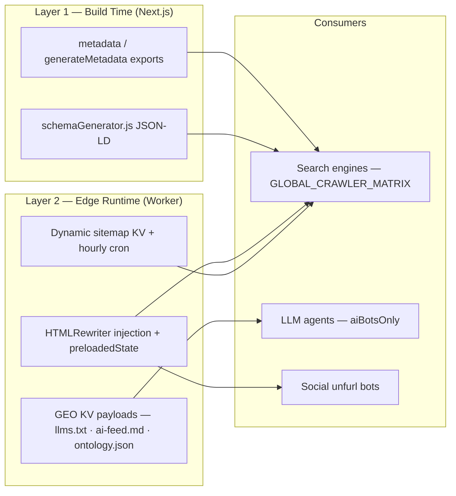

# FE-06 — SEO, Metadata & GEO Pipelines

**Project:** `treishvaam-finance-frontend`
**Classification:** Internal — Engineering Reference
**Verified against:** `app/terms|vision/page.tsx` metadata exports, `app/category/.../page.tsx` (per FIN-02), `worker/worker.js` SEO intelligence (per FIN-03), `src/utils/schemaGenerator.js`, GEO route handlers, `public/sitemap*.xml`, `robots.txt` (existence)

---

## 1. Three-Layer SEO Architecture



| Layer | Owner | Strength |
| :--- | :--- | :--- |
| Build-time metadata | Next.js App Router | Per-route canonical/OG/twitter without runtime cost |
| Edge injection | `treishfin-seo-worker` | Crawler-visible guarantees even for client-rendered content; SPA 404→200 protection |
| GEO | Worker + KV + backend | Machine-readable corpus for AI answer engines, bypassing React entirely |

## 2. Build-Time Metadata (Next.js)

**Static pages** export `metadata` (verified pattern from `/terms`):

```tsx
export const metadata = {
  title: 'Terms of Service | Treishvaam Finance',
  description: '…',
  alternates: { canonical: 'https://treishvaamfinance.com/terms' },
  openGraph: { type: 'website', url: '…', title: '…', description: '…',
               images: ['https://treishvaamfinance.com/logo.webp'] },
  twitter: { card: 'summary', title: '…', description: '…', images: ['…/logo.webp'] },
};
```

**Dynamic route** `/category/[categorySlug]/[postSlug]/[id]` uses `generateMetadata({ params })`: Edge-side post fetch (**must include `X-Tenant-ID: finance`** — omission breaks tenant isolation), then unique title/description/OG image/twitter card, Article JSON-LD (`datePublished`, `dateModified`, `author`, `publisher`), and exact production canonical. `/market/[ticker]` applies equivalent per-ticker metadata.

**Migration rule:** `react-helmet-async` metadata in legacy `src/pages/*` caused Edge SSR crashes (`TypeError: Cannot read properties of undefined (reading 'add')`); all pages migrate to App Router metadata exports — wrappers that had `"use client"` cannot export metadata and must be restructured (see `/privacy` vs `/terms`).

## 3. Edge SEO Pipeline (Worker `HTMLRewriter`)

| Route | Injection |
| :--- | :--- |
| `/`, `/home` | WebSite JSON-LD + GEO discovery links (`<link rel="alternate" type="text/markdown" href="/llms.txt">`, `<link rel="alternate" type="application/json+ld" href="/ontology.json">`) |
| `/about`, `/vision` | Static title/description meta + GEO links |
| `/category/…/:id` | Backend post fetch → `<title>`, `meta[description]`, `window.__PRELOADED_STATE__` (sanitized), GEO links |
| `/market/:ticker` | Backend market fetch → ticker title + `__PRELOADED_STATE__`, GEO links |

Guards: entire block wrapped in `if (!isRscRequest)` (RSC stream corruption fix — immutable); SPA fallback overrides 404→200 for known routes (prevents SPA 404 SEO penalties); HTML cached `public, max-age=600`; 5xx serves stale CDN cache. The app's root layout additionally emits GEO discovery tags and a `<semantic-chunk data-aegis-geo="active">` wrapper.

## 4. JSON-LD Structured Data

| Schema | Emitter | Where |
| :--- | :--- | :--- |
| `Article` (incl. dates/author/publisher) | `generateMetadata` route + `schemaGenerator.js` | Post pages |
| `BreadcrumbList` | `schemaGenerator.js` | Post pages |
| `WebPage`, `Organization` | `schemaGenerator.js` | Site-wide |
| `WebSite` | Worker injection | `/`, `/home` |
| Ontology graph (JSON-LD) | `GET /ontology.json` (backend `/api/public/geo/ontology.json`, KV-cached) | LLM consumption |

Validation guidance: run structured-data validators against the **Worker-served HTML** (not raw React output), since injection happens at the Edge.

## 5. GEO — Generative Engine Optimization (LLM Discovery)

| Asset | Route / Source | Content-Type | Cache |
| :--- | :--- | :--- | :--- |
| `llms.txt` | Worker KV → Next handler → backend `/api/public/geo/llms.txt` | `text/plain` | CDN → KV `geo:finance:*` (TTL 86400) → backend |
| `ai-feed.md` | Same chain | `text/markdown` | Same |
| `ontology.json` | Same chain | `application/json` | Same |

Behavior: AI bots in `aiBotsOnly` requesting **any** HTML GET are aggressively intercepted and served `/ai-feed.md` from KV — they never execute React. All AI-bot responses carry `X-GEO-Bot-Detected: true`. Cache headers: `public, s-maxage=86400, max-age=3600`.

## 6. Sitemaps & robots.txt

- **Static index:** `public/sitemap.xml` (+ `sitemap-static.xml`) points to backend dynamic sitemaps.
- **Dynamic pipeline:** `/sitemap-dynamic/{blog,market}/N.xml` → Worker three-tier cache → KV keys `sitemap:finance:*` (TTL 90000) → backend `/api/public/sitemap/*`. Hourly cron pre-warms meta + first 5 sitemaps with per-path fresh signatures (FE-02 §9).
- **robots.txt:** served as a static asset through the Worker with security headers; directives as maintained in `public/robots.txt` (⚠ specific directive values not present in provided excerpts — consult the repository file).
- **Search verification:** `public/googleba974015553e7035.html` (Google Search Console ownership).
- **OpenSearch:** `/opensearch.xml` (self-generated) enables browser search-engine registration; site search itself runs through `/api/v1/search/query` (Elasticsearch-backed) with 300 ms debounced autocomplete.

## 7. Open Graph & Social Cards — Current Implementation

| Page class | OG image source |
| :--- | :--- |
| Static pages (`/terms`, `/vision`, …) | `https://treishvaamfinance.com/logo.webp` |
| Articles | Post cover/thumbnail (from post payload, MinIO-hosted) via `generateMetadata` |
| Twitter | `summary` card (verified); article routes enrich per-post |

> [!NOTE]
> **Dynamic OG image generation (⚠ Requires clarification):** No runtime OG-image renderer (e.g., `@vercel/og`-style) exists in the provided codebase. "Dynamic OG" is achieved **per-article via post media**, not by generating images on the fly. If server-rendered branded OG cards are a product requirement, it is a **new capability**, not a regression — open an architecture change before implementing (it would require an Edge image runtime compatible with the Worker/Pages constraints).

## 8. SEO-Critical Operational Rules

1. **Auth is bot-blind:** `AuthContext` skips Keycloak init entirely for Googlebot/Lighthouse/headless clients — Keycloak must never gate crawler HTML (verified bot keyword list in FE-04).
2. **Verified crawlers bypass AEGIS threat evaluation** at the Worker — indexability is never collateral damage of threat gating.
3. **RSC requests never receive SEO injection** — the `isRscRequest` guard is immutable.
4. **Emergency refresh:** `GET /sys/force-update` re-runs the sitemap cron immediately.
5. **Canonical apex:** `/home` 301 → `/` (middleware) — never create duplicate-content entry points.
