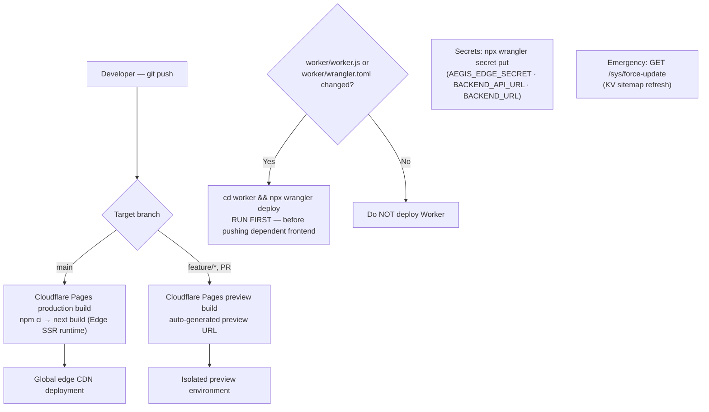

# FE-07 — Build & Deployment (Cloudflare Pages + Edge Worker)

**Project:** `treishvaam-finance-frontend`
**Classification:** Internal — Engineering Reference
**Verified against:** `.env` / `.env.example`, `next.config.mjs`, `package.json`, `worker/wrangler.toml`, FIN-01 §7 (deployment pipeline), FIN-03 §2

---

## 1. Deployment Model

Two independently versioned artifacts share the `treishvaamfinance.com` origin:

1. **Cloudflare Pages project** (`treishvaam-finance-frontend`) — the Next.js 14 Edge SSR application.
2. **Cloudflare Worker** (`treishfin-seo-worker`) — routed on `treishvaamfinance.com/*`, the sole entry point.

They are deployed through **different pipelines with a strict ordering rule** (§6). This tier is fully decoupled from the backend's **Engine A / Engine B** dual-engine deployment (see §9 for the boundary and the cross-system caution).



## 2. Build Pipeline (Cloudflare Pages)

- **Trigger:** automatic on push to `main` (production) and on any branch/PR (preview).
- **Commands:** `npm ci` (never `npm install`) followed by the Next.js production build executing under the Cloudflare Pages Next.js (Edge SSR) build path; the `runtime = 'edge'` export and `middleware.ts` require this Edge build mode (FE-01 §1).
- **Output:** deployed to the global Cloudflare CDN.

> [!WARNING]
> **Lockfile invariant:** `package-lock.json` must be committed in lockstep with `package.json`. `npm ci` desync **crashes Cloudflare Pages builds**. Never hand-edit either file.
>
> **Build leniency:** `eslint.ignoreDuringBuilds` and `typescript.ignoreBuildErrors` are deliberate deployment-resilience flags. Type/lint enforcement happens in local development and IDE — do not treat green CI builds as proof of type safety.
>
> **Verified Pages project IaC (root `wrangler.toml`):** `pages_build_output_dir = ".vercel/output/static"` (the `@cloudflare/next-on-pages` adapter output, aligned to adapter v1.13.16 per its change history), `compatibility_flags = ["nodejs_compat"]`, `compatibility_date = "2024-11-20"`. The adapter is invoked at build time — it is not a package.json dependency. The root wrangler.toml is **required infrastructure**, not a duplicate of worker/wrangler.toml. (Only remaining open item: the literal dashboard Build command string.)

## 3. Local Development

```bash
cp .env.example .env      # populate NEXT_PUBLIC_API_URL + NEXT_PUBLIC_AUTH_URL
npm run dev               # port 3000; Serwist service worker auto-disabled in dev
```

Local defaults: `NEXT_PUBLIC_API_URL=http://localhost:8080`, `NEXT_PUBLIC_AUTH_URL=http://localhost:8080/auth` (backend + Keycloak on the same host, or a Cloudflare Tunnel URL).

## 4. Environment Variable Matrix

Set in **Cloudflare Dashboard → Workers & Pages → treishvaam-finance-frontend → Settings → Environment Variables** (never in git). Only the `NEXT_PUBLIC_*` prefix is valid; `REACT_APP_*` is prohibited and non-functional.

| Variable | Scope | Purpose |
| :--- | :--- | :--- |
| `NEXT_PUBLIC_API_URL` | Pages (all envs) | Spring Boot backend base URL (Cloudflare Tunnel URL in production) |
| `NEXT_PUBLIC_AUTH_URL` | Pages (all envs) | Keycloak base URL (`/auth` path); trailing slashes are normalized at runtime, but keep it clean |
| `NEXT_PUBLIC_GA_MEASUREMENT_ID` | Pages | GA4 `G-XXXXXXXXXX` |
| `NEXT_PUBLIC_GOOGLE_ADS_ID` | Pages | Ads conversion `AW-XXXXXXXXXX` |
| `NEXT_PUBLIC_ADSENSE_CLIENT_ID` | Pages | AdSense `ca-pub-*` |
| `NEXT_PUBLIC_ENFORCE_STRICT_PRIVACY` | Pages + Worker `[vars]` | `true` → GA4 `anonymize_ip` (GDPR/DPDP toggle). Default `false` — **never hardcode the anonymization in code** (FE-04 §11) |
| `NEXT_PUBLIC_CHAIRMAN_PORTRAIT_URL` | Pages | Swappable portrait asset URL (MinIO/media CDN) — no rebuild needed |
| `NEXT_PUBLIC_FARO_URL` | Pages (Production + Preview) | Grafana Faro collector endpoint; build-time inlined; falls back to `https://backend.treishvaamgroup.com/faro/collect`. CSP-coupled: any non-`*.treishvaamgroup.com` origin requires a `connect-src` update in `middleware.ts` |

**Worker secrets** (via `npx wrangler secret put`, never in `wrangler.toml`):

| Secret | Purpose |
| :--- | :--- |
| `AEGIS_EDGE_SECRET` | HMAC-SHA-512 signing seed — **must byte-match backend `AEGIS_EDGE_SECRET`** (FE-02 §2) |
| `BACKEND_API_URL` | Cloudflare Tunnel URL to `finance-api` |
| `BACKEND_URL` | Fallback alias |

> [!CAUTION]
> Rotating `AEGIS_EDGE_SECRET` is a **coordinated two-sided operation**: rotate the Worker secret and the backend secret in the same maintenance window, or every proxied request will be rejected by `AegisEdgeValidationFilter` (total API outage behind a healthy-looking frontend). Rotation procedure belongs in `RUNBOOKS.md` (Session 3).

## 5. PWA Build Artifact

`@serwist/next` compiles `src/sw.ts` → `public/sw.js` during the Pages build (`disable: true` in development). If the service worker build fails, check the two immutable constraints: the `webworker` lib reference on line 1, and Strategy handlers as instantiated classes (FE-01 §7.3).

## 6. Worker Change Control (Ordering Rule)

> [!CAUTION]
> **Deploy the Worker only when `worker/worker.js` or `worker/wrangler.toml` actually changed — and deploy it FIRST**, then push the frontend changes that depend on it. Never run `npx wrangler deploy` for pure frontend changes: an out-of-order or gratuitous Worker deploy can transiently desynchronize signing/threat KV behavior against the backend contract mid-rollout.

```bash
cd worker/
npx wrangler deploy          # only on worker/ changes, before dependent frontend push
npx wrangler secret put …    # secrets only; never write secrets into wrangler.toml
```

## 7. Preview Environments

- Cloudflare Pages automatically builds **preview deployments** for every non-production branch/PR with unique preview URLs (standard platform capability).
- Environment variables are scoped per environment (Production / Preview / Development) in the dashboard — `NEXT_PUBLIC_*` values are **inlined at build time**, so previews render with whatever Preview-scoped values are configured.
- The Worker route is bound to the production domain; preview frontends exercise backend-dependent behavior only through the production Worker/API path unless separately staged.
- ⚠ Requires clarification: organization policy for a dedicated staging Worker route/KV namespace (the Agro worker parity gap in FE-02 §13 suggests staging conventions are still maturing). Document the chosen policy here once decided.

## 8. Post-Deployment Operations

| Task | Procedure |
| :--- | :--- |
| Emergency KV/sitemap refresh | `GET https://treishvaamfinance.com/sys/force-update` (invokes the hourly cron immediately) |
| HTML cache window | Worker caches successful page responses `public, max-age=600` — plan announcements around ≤10 min propagation |
| GEO/sitemap KV TTLs | 86400 s (GEO) / 90000 s (sitemaps) — cron keeps these warm hourly |
| Frontend rollback | Cloudflare Pages **instant rollback** to any previous deployment from the dashboard (platform capability); KV/cron state is independent of rollback |
| Worker rollback | `wrangler` deployments are versioned — roll back via the Cloudflare dashboard or re-deploy the previous `worker.js` from git |

## 9. Boundary with Backend Engine A / Engine B Deployment

The frontend tier does **not** participate in the backend's dual-engine system: frontend builds run entirely on Cloudflare's managed build infrastructure, never on the self-hosted GitHub Actions runner that triggers Engine B (`auto_deploy.sh` via `sudo systemd-run --no-block`).

However, two cross-system rules apply to anyone operating both tiers:

> [!CAUTION]
> 1. **Never execute `docker compose down` on the production host.** It destroys the Docker bridge network, collapses host routing, severs SSH, and locks out the deployment server. Always use `docker compose stop` / `up -d --remove-orphans`, and run `/scripts/kernel-mount-recovery.sh` if recovery is needed. Full procedure: **`BE-03-DEPLOYMENT.md`**.
> 2. **Runner daemon zombification:** every backend deployment must restart the Actions runner via `setup_runner_service.sh`. A zombified runner silently stops triggering backend pipelines — which frontend releases that depend on backend contract changes will then block on. Full procedure: `BE-03-DEPLOYMENT.md`.

Contract-coupled releases (HMAC inputs, header names, MTD manifest schema, GEO/sitemap backend endpoints) **must** ship Worker + backend changes in the same window, with `CROSS-SYSTEM-CONTEXT.md` updated in the same commit trail.

## 10. Deployment Checklist

- [ ] `package-lock.json` and `package.json` committed together; `npm ci` succeeds locally
- [ ] Type-check and lint run **locally** (CI leniency flags mean builds pass where types don't)
- [ ] No secrets, URLs, or publisher IDs hardcoded; all values via env
- [ ] Worker changed? → `npx wrangler deploy` **first**, then push
- [ ] Worker unchanged? → confirm no gratuitous deploy
- [ ] Backend contract touched? → coordinate window with Engine B operators; update `CROSS-SYSTEM-CONTEXT.md`
- [ ] Post-deploy: verify `/sys/force-update` returns 200; spot-check `/llms.txt`, a `/category/…` article's injected `<title>`, and `/sitemap-dynamic/blog/0.xml`
- [ ] Verify signed API path end-to-end (any market widget loading live data proves the HMAC chain)

## 11. Known Issues Affecting Deployment

| Item | Impact |
| :--- | :--- |
| Stale `homepage` field in `package.json` (legacy domain) | Cosmetic; does not affect routing — update opportunistically |
| Dead CRA entry points (`src/App.js`, `src/index.js`) | None at runtime; remove in a dedicated cleanup PR only |
